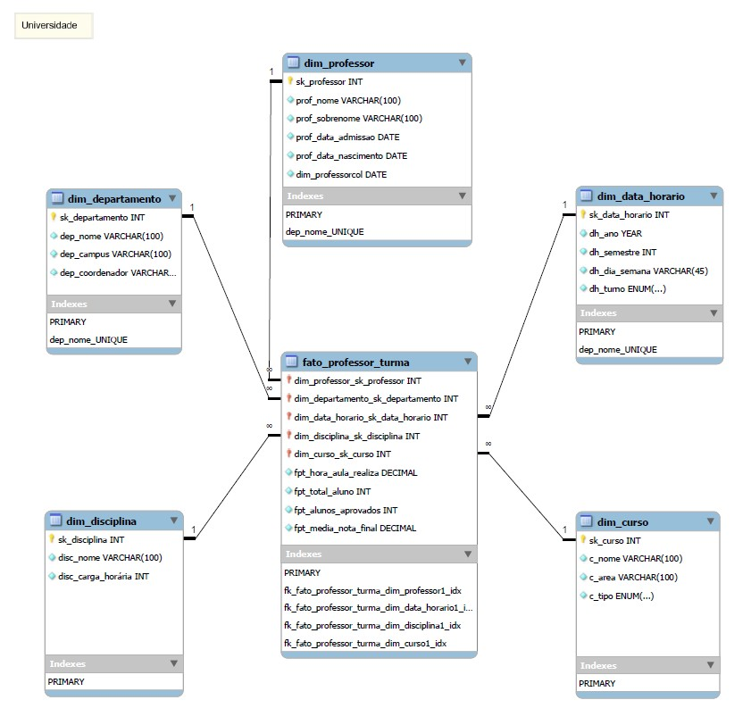

# Desafio de Projeto: Modelagem Dimensional (*Star Schema*)

## Introdução:
Este projeto apresenta a modelagem de um banco de dados dimensional tipo *star schema* e foi desenvolvido para atender ao **Desafio de Projeto: “Modelagem Dimensional”**, que integra o Bootcamp Klabin – Excel e Power BI Dashboards na DIO.

## Objetivo:

Realizar a modelagem de um banco de dados dimensional tipo *star_schema*
a partir de um modelo relacional *ER* já existente.

### Requisitos:

-   Utilizar modelo **star_schema**;
-   Criar a tabela fato com foco na análise de dados dos professores;
-   Não refletir os dados dos alunos;
-   Criar as tabelas dimensão;
-   Criar uma tabela dimensão de datas para compensar a falta de dados de datas do modelo relacional;
-   Definir a granularidade para a dimensão data;

## Solução Apresentada:

## Detalhamento da Solução Apresentada:

### Tabela Fato: *fato_professor_turma*

Esta tabela é o centro do modelo dimensional e contém as principais
medidas que serão analisadas, além dos relacionamentos com as tabelas
dimensão por meio de *surrogate_keys*.

#### Medidas definidas:

-   **hora_aula_realizada**: total de horas/aula efetivamente
    ministradas pelo professor;
-   **total_alunos**: número total de alunos matriculados na turma;
-   **alunos_aprovados**: total de alunos aprovados;
-   **media_nota_final**: média da nota final dos alunos da turma;

#### Chaves Estrangeiras (FKs):

-   **sk_professor**
-   **sk_departamento**
-   **sk_data_horario**
-   **sk_curso**
-   **sk_disciplina**

#### Granularidade:

A granularidade definida para a da tabela **fato_professor_turma** é: **1 linha por professor por turma no semestre**

### Tabelas Dimensão:

-   **dim_professor**\
-   **dim_departamento**\
-   **dim_data_horario**\
-   **dim_curso**\
-   **dim_disciplina**

 

## Arquivos:

- [X] Projeto Modelagem Dimensional (formato .mwb): [Clique aqui para visualizar o arquivo.](stvmmuniz_star_schema_universidade.mwb)
 
- [X] Projeto Modelagem Dimensional (formato PDF): [Clique aqui para visualizar o arquivo.](stvmmuniz_star_schema_universidade.pdf)
 

     
  
**Escrito por:** *stvmmuniz*
